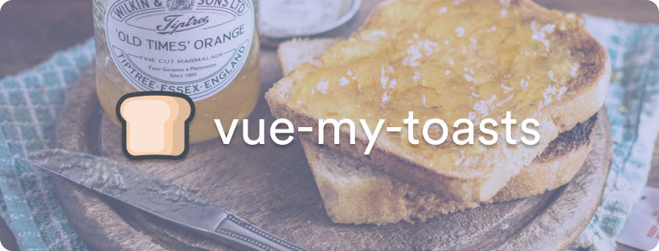

<p align="center">
    
</p>

---

# 🍞 vue-my-toasts

A Vue toast plugin that finally lets you create your own toast component.

You can see a demo of the default behaviour [here](https://vue-my-toasts.netlify.app).

## ❓ Why another toast plugin ?

Most toast plugins out here comes with a _pre-defined style_.

I love some of these plugins, but you can't assume that your design will be used in _every projects_.

This plugin aims to _abstract what is boring_ in creating a toast notification plugin, and let you _focus on designing_ your toast component while keeping a simple API to interact with.

## 🛠 Setup

Add it to your project with your favorite package manager.

```bash
npm install vue-my-toasts
```

```bash
yarn add vue-my-toasts
```

## ⚙ Configure

Inject the plugin to your Vue instance, and configure it using the parameters.

Do not forget to import the `css` file, it is needed to display the wrapper component properly.

```javascript
import VueMyToasts from 'vue-my-toasts'
import 'vue-my-toasts/dist/vue-my-toasts.css'
import YourToastComponent from '~/components/toasts/YourToastComponent'

Vue.use(VueMyToasts, {
  component: YourToastComponent,
  options: {
    width: '400px',
    position: 'bottom-right',
    padding: '1rem'
  }
})
```

The whole principle of this package is to build your own toast component.

It comes with two included components, based on Tailwind and Bootstrap.

Both of those components are ready to be used straight from your app, or to be copy/pasted to create your own implementation.

If you want to see the included component, you can watch the demo [here](https://vue-my-toasts.netlify.app).

```javascript
import VueMyToasts from 'vue-my-toasts'
// import BootstrapComponent from "vue-my-toasts/src/components/toasts/BootstrapComponent";
import TailwindComponent from 'vue-my-toasts/src/components/toasts/TailwindComponent'

Vue.use(VueMyToasts, {
  // component: BootstrapComponent,
  component: TailwindComponent,
  options: {
    width: '400px',
    position: 'bottom-right',
    padding: '1rem'
  }
})
```

### Base parameters

- `width`: The max width for a toast (as CSS attribute)
- `padding`: The padding of the box handling the toasts list (as CSS attribute)
- `position`: The position of the toast list, can be: `bottom-right`, `bottom-left`, `top-right`, `top-left`, `top-middle`, `bottom-middle`

Note that you can add as many parameters you want, they will be passed as props to your toast component.

## 👨‍💻 Usage

vue-my-toasts come with a simple API that you can use from anywhere in your codebase.

As it is a Vue plugin, we inject our main functions and helpers in the Vue prototype under the key `$toasts`.

You can so access this from anywhere in your Vue components, and generally from anywhere you have access to your Vue instance.

```javascript
export default {
  name: 'MyComponent',

  mounted() {
    // From helpers
    this.$toasts.success('This is my favorite toasts plugin.', {
      // Any other parameter...
    })

    // From base function
    this.$toasts.push({
      type: 'warning',
      message: 'This is definitely my favorite toasts plugin.'
      // Any other parameter...
    })
  }
}
```

### API

- `$toasts.base('message', options)`: Push a base message (options is facultative)
- `$toasts.success('message', options)`: Push a success message (options is facultative)
- `$toasts.warning('message', options)`: Push a warning message (options is facultative)
- `$toasts.error('message', options)`: Push a error message (options is facultative)
- `$toasts.push(options)`: Push a message from a raw toast payload
- `$toasts.remove(id)`: Remove a toast from its unique id
- `$toasts.updateConfig(newConfig)`: Update the toasts base config

Note that you can add as many parameters you want to `options` object, they will be passed as props to your toast component.

## 👨‍🎨 Create your own

If you want to create your own component, you can start from the [Demo one](src/components/toasts/TailwindComponent.vue).

You need to import the [ToastMixin](src/mixins/ToastMixin.js) in your component, so you have a good start with the default configuration.

If you want to have a timer inside your component, you can import the [TimerMixin](src/mixins/TimerMixin.js).

### Attributes

Attributes accessible by using the included mixins:

- Using [ToastMixin](src/mixins/ToastMixin.js):
- `this.id`: The ID of the toast, you can provide it yourself or it will be auto-generated.
- `this.index`: The index of the toast inside the currently visible list
- `this.type`: The type of the toast, can be: `base`, `warning`, `error`, `success`
- `this.position`: The position of the toast, can be: `bottom-right`, `bottom-left`, `top-right`, `top-left`, `top-middle`, `bottom-middle`
- `this.message`: The message of the toast.

- Using [TimerMixin](src/mixins/TimerMixin.js):
- `this.duration`: The duration for which the toast will be shown (in ms)
- `this.percentageElapsed`: The percentage elapsed of the toast duration
- `this.remaining`: The remaining time of the toast visible duration

### Events

- `$emit('remove')`: Remove event, that will close the current current toast.

## 👋 Credits

[Yaël GUILLOUX](mailto:yael.guilloux@gmail.com)

Follow my work on [yael.dev](https://yael.dev).

## 🔏 License

The MIT License (MIT). Please see [License File](LICENSE) for more information.
